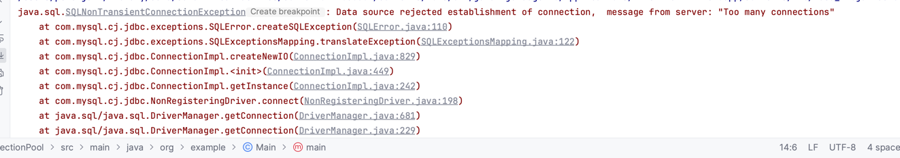
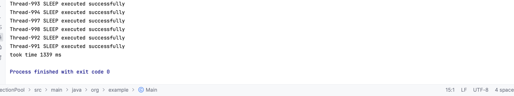

# installation steps
1. docker pull mysql
2. docker run --name mysql-container -e MYSQL_ROOT_PASSWORD=myrootpassword -e MYSQL_DATABASE=test -e MYSQL_USER=test -e MYSQL_PASSWORD=test -p 3306:3306 -d mysql

# context

Ran an experiment with and without connection pool between application and database

# Results

1. Without connection pool (number of concurrent requests : 1000)

2. With Connection Pool  (number of concurrent requests : 1000)
